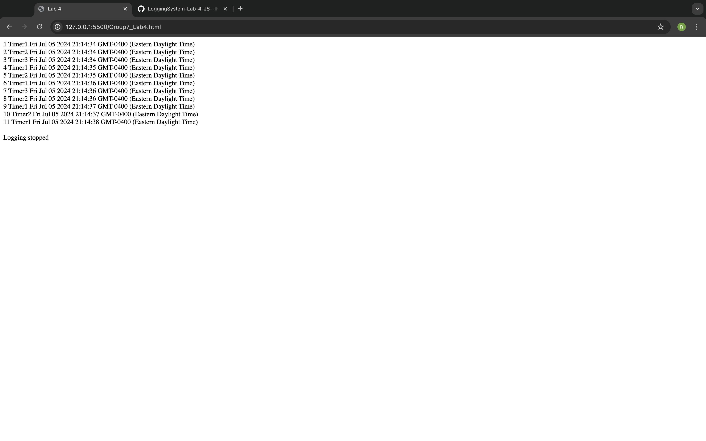

# Lab 4 - Simple Logging System

## Description

This project is a proof of concept for a simple logging system using JavaScript timers. It demonstrates the usage of JavaScript intervals to log function calls with timestamps. The logging stops automatically after a specified number of logs.

## Features

- Three timers (`Timer1`, `Timer2`, and `Timer3`) with different intervals (1000ms, 1200ms, 1700ms).
- Logs the caller's name and the timestamp for each interval.
- Stops logging after 10 entries.

## Output

## Code Explanation

- The `log` function is an Immediately Invoked Function Expression (IIFE) that maintains a count and logs the caller's name and timestamp.
- The `printFunc` function appends the output to the body of the HTML document.
- The `startMeUp` function sets up three intervals and starts logging when the page loads.

## Files

- `index.html`: The main HTML file containing the JavaScript code for the logging system.
